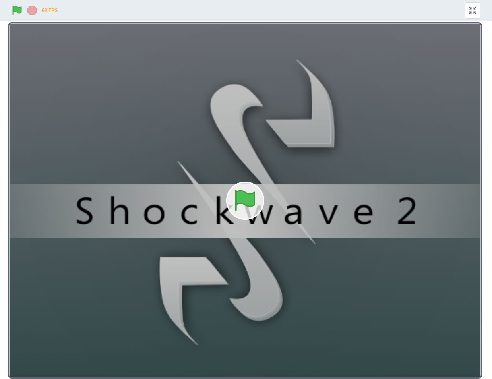

# Shockwave2
A Sprite 3D Game Engine coded with Scratch 3 with realistic graphics, verticality, and physics.

The engine has been unshared from Scratch multiple times due to "being too scary" & "violence", so this is the new home for Shockwave 2.

For documentation on how to use Shockwave 2, go to the wiki tab of the repository.

